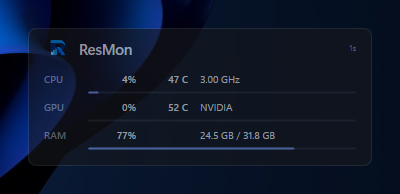

  

<h1 align="center">ResMon</h1>

  A deliberately lightweight Windows 11 resource monitor, 
  implemented in native C++/Win32 with Direct2D/DirectWrite.

  
  
  

  

## Download

**[Download the latest release](https://github.com/m4d3/ResMon/releases/latest)** — `ResMon-<version>-win-x64.zip`

Unzip it and run `ResMon.exe`. No installer, no runtime, no dependencies: a single
self-contained x64 executable for Windows 11. Everything else in the ZIP is
documentation and licence text.

> The executable is unsigned, so SmartScreen may warn on first launch
> (*More info -> Run anyway*). You can also build it yourself — see
> [Build from source](#build-and-run).

## Temperature sources

The Temperature column can show both CPU and NVIDIA GPU readings:

- **Intel CPU:** package temperature from `IA32_TEMPERATURE_TARGET` + `IA32_PACKAGE_THERM_STATUS` through PawnIO.
- **AMD Zen CPU:** die/Tctl-style temperature from the SMN thermal-control register through PawnIO.
- **CPU fallback:** Windows `Thermal Zone Information(*)\Temperature` PDH counter when firmware exposes a useful ACPI zone.
- **NVIDIA GPU:** native NVIDIA Management Library (NVML), dynamically loaded from the installed NVIDIA display driver. Multiple supported NVIDIA GPUs are handled by displaying the hottest GPU die reading.

NVML is loaded only when the Temperature column is enabled and its slower temperature polling interval is due. It does not require `nvidia-smi`, CUDA Toolkit installation, Python, .NET, or a bundled NVIDIA library. NVIDIA documents NVML as the C API underneath `nvidia-smi`; on Windows the DLL is supplied by supported driver installations.

## Enhanced CPU-temperature permissions

PawnIO is a signed kernel driver used only for restricted low-level CPU sensor access. ResMon does **not** weaken its security descriptor.

- ResMon works normally as a standard user.
- Right-click **Sensors -> Install enhanced CPU temperature...** to install PawnIO from the copy embedded in `ResMon.exe`.
- Installation triggers the normal Windows UAC prompt.
- On systems where direct hardware access remains administrator-only, ResMon can restart elevated for the enhanced CPU reader.
- NVIDIA NVML temperature reading does not use PawnIO.

The final application remains a single `ResMon.exe` to keep/copy. Windows stores the installed PawnIO driver separately as a system driver, as required for low-level MSR/SMN access.

## Why it stays lightweight

- Native C++20 Win32 executable.
- Direct2D/DirectWrite UI.
- No Python, Qt, .NET, WinUI/XAML, Electron, or browser engine.
- Default polling interval is 2 seconds; selectable 1 / 2 / 5 seconds.
- CPU clock probing is throttled to roughly every 10 seconds.
- CPU/GPU temperature polling is slower than load polling.
- NVML is loaded dynamically only when temperature data is requested.
- GPU/network/disk PDH collection is skipped when the corresponding row is hidden.
- Easing uses a short-lived timer that stops once values settle.
- Static MSVC runtime for a self-contained Release EXE.

## Build and run

1. Clone the repository (or download the source ZIP from GitHub).
2. Double-click `BUILD_AND_RUN.cmd`.
3. On the first build, the script downloads and verifies the small PawnIO sensor resources, then builds Release x64 and launches ResMon.

Typical output:

`build\Release\ResMon.exe`

Requirements:

- Windows 11 x64
- CMake 3.24+
- Visual Studio / Build Tools with **Desktop development with C++**
- Windows 11 SDK
- Internet access for the first build to fetch pinned PawnIO/LHM sensor resources

The build pins PawnIO setup 2.2.0 and LibreHardwareMonitor v0.9.6's `IntelMSR.bin` / `AMDFamily17.bin` PawnIO modules. These are embedded in the built EXE. NVML is **not downloaded or embedded**; it is supplied by the NVIDIA driver when available.

## Right-click menu

- **Rows** -> CPU / GPU / RAM / Temperature / Network / Disk I/O
- **Always on top**
- **Update rate** -> 1 / 2 / 5 seconds
- **Theme** -> Dark / Light
- **Opacity...** -> native Windows trackbar
- **Sensors** -> optional enhanced CPU sensor install/refresh; NVIDIA GPU temperature is automatic
- **Start with Windows**
- Reset position / About / Exit

## Third-party components

See `THIRD_PARTY.md`. PawnIO and the PawnIO modules are embedded at build time. NVML is dynamically loaded from the locally installed NVIDIA driver and is not redistributed in this package.

## MSIX / Microsoft Store

`PACKAGE_MSIX.ps1` creates an unsigned MSIX from the built EXE. Low-level driver installation has additional Store policy/signing considerations, so the ordinary EXE build is the recommended distribution path for the enhanced CPU-temperature version.

_Release notes for the current version are on the [releases page](https://github.com/m4d3/ResMon/releases/latest)._
